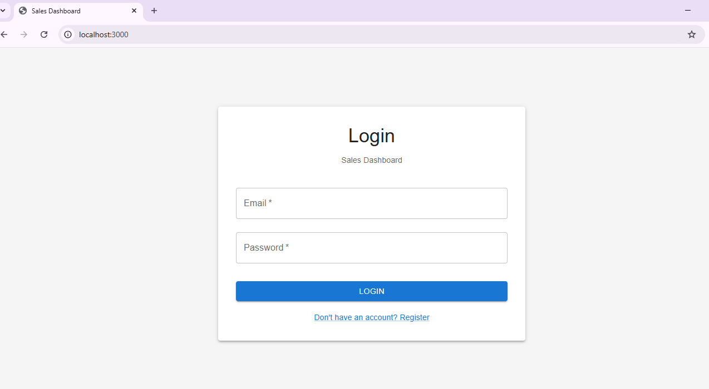
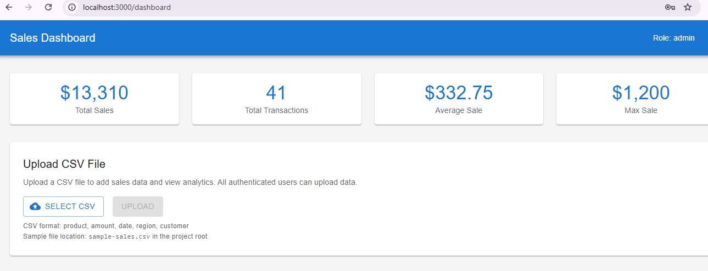
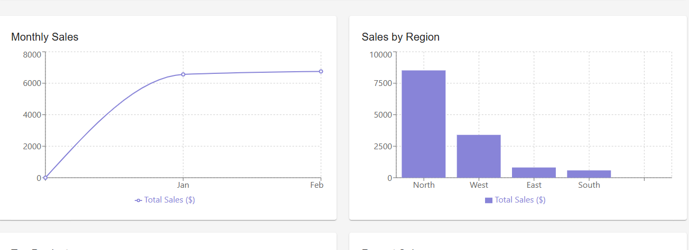
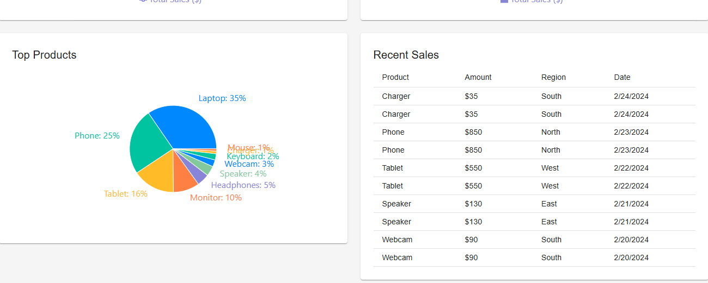

# 📊 MERN Sales Dashboard

A full-stack sales analytics dashboard built with MongoDB, Express, React, and Node.js. Features user authentication, CSV data upload, and interactive data visualization.


## ✨ Features

- 🔐 **User Authentication** - JWT-based login/register system
- 📁 **CSV File Upload** - Easy data import with automatic parsing
- 📊 **Interactive Charts** - Line, Bar, and Pie charts using Recharts
- 📈 **Real-time Analytics** - Monthly, Regional, and Product-wise statistics
- 🎨 **Modern UI** - Beautiful Material-UI components
- 🔒 **Protected Routes** - Secure API endpoints
- 👥 **Multi-user Support** - Any authenticated user can upload data

## 🖼️ Screenshots

### Login Page

*Clean and simple login interface with registration option*

### Dashboard Overview

*Complete dashboard with statistics cards, charts, and data tables*

### CSV Upload

*Easy CSV file upload interface*

### Analytics Charts

*Interactive charts showing monthly sales, regional breakdown, and top products*

### Statistics View

*Comprehensive statistics including total sales, transactions, and averages*

## 🚀 Quick Start

### Prerequisites

- Node.js (v14 or higher)
- MongoDB (local or MongoDB Atlas)
- npm or yarn

### Installation

1. **Clone the repository**
   ```bash
   git clone https://github.com/your-username/mern-sales-dashboard.git
   cd mern-sales-dashboard
   ```

2. **Backend Setup**
   ```bash
   cd backend
   npm install
   ```
   
   Create `.env` file:
   ```env
   MONGO_URI=mongodb://localhost:27017/salesdb
   JWT_SECRET=your_secret_key_change_in_production
   PORT=5000
   ```
   
   Start backend:
   ```bash
   npm start
   ```

3. **Frontend Setup**
   ```bash
   cd frontend
   npm install
   ```
   
   Start frontend:
   ```bash
   npm start
   ```

4. **Access the Application**
   - Frontend: http://localhost:3000
   - Backend API: http://localhost:5000

## 📖 Usage

### 1. Register/Login

- Open http://localhost:3000
- Register a new account (first user is automatically admin)
- Or login with existing credentials

### 2. Upload CSV Data

1. Click "Select CSV" button
2. Choose your CSV file (format: `product,amount,date,region,customer`)
3. Click "Upload"
4. Dashboard automatically refreshes with new data

### 3. View Analytics

After uploading data, you'll see:
- **Statistics Cards**: Total sales, transactions, averages
- **Monthly Sales Chart**: Line chart showing sales over time
- **Regional Breakdown**: Bar chart by region
- **Top Products**: Pie chart of best-selling products
- **Recent Sales Table**: Latest transactions

## 📁 Project Structure

```
mern-sales-dashboard/
├── backend/              # Node.js/Express server
│   ├── models/           # MongoDB schemas (User, Sale)
│   ├── routes/           # API endpoints (auth, sales)
│   ├── middleware/       # Authentication middleware
│   ├── server.js         # Express server setup
│   └── package.json
├── frontend/             # React application
│   ├── src/
│   │   ├── pages/        # Dashboard, Login pages
│   │   ├── utils/        # API configuration
│   │   ├── App.js        # Main app component
│   │   └── index.js
│   └── package.json
├── screenshots/          # Application screenshots
├── sample-sales.csv      # Sample data file
└── README.md
```

## 🔌 API Endpoints

### Authentication
- `POST /api/auth/register` - Register new user
- `POST /api/auth/login` - Login user
- `POST /api/auth/make-admin` - Make user admin (if no admin exists)

### Sales
- `GET /api/sales` - Get all sales (paginated)
- `POST /api/sales/upload` - Upload CSV data (any authenticated user)
- `GET /api/sales/analytics/monthly` - Monthly analytics
- `GET /api/sales/analytics/regional` - Regional analytics
- `GET /api/sales/analytics/products` - Product analytics
- `GET /api/sales/analytics/stats` - Overall statistics

## 📝 CSV Format

Your CSV file must include these columns:

```csv
product,amount,date,region,customer
Laptop,1200,2024-01-15,North,John Doe
Mouse,25,2024-01-16,South,Jane Smith
Keyboard,75,2024-01-17,East,Bob Johnson
```

**Required columns:**
- `product` - Product name
- `amount` - Sale amount (number)
- `date` - Date in YYYY-MM-DD format
- `region` - Sales region
- `customer` - Customer name

## 🛠️ Technologies Used

### Backend
- **Express.js** - Web framework
- **MongoDB/Mongoose** - Database and ODM
- **JWT** - Authentication tokens
- **bcryptjs** - Password hashing
- **PapaParse** - CSV parsing

### Frontend
- **React** - UI library
- **React Router** - Routing
- **Material-UI** - Component library
- **Recharts** - Data visualization
- **Axios** - HTTP client

## 🔐 Security Features

- Password hashing with bcrypt
- JWT token-based authentication
- Protected API routes
- Input validation and sanitization
- CORS configuration

## 📊 Features in Detail

### Dashboard Components

1. **Statistics Cards**
   - Total Sales
   - Total Transactions
   - Average Sale Amount
   - Maximum Sale

2. **Charts**
   - Monthly Sales (Line Chart)
   - Sales by Region (Bar Chart)
   - Top Products (Pie Chart)

3. **Data Tables**
   - Recent Sales with pagination
   - Sortable columns
   - Responsive design


## 👨‍💻 Author

Your Name - [Yogidc](https://github.com/yogidc)


⭐ If you like this project, please give it a star on GitHub!
